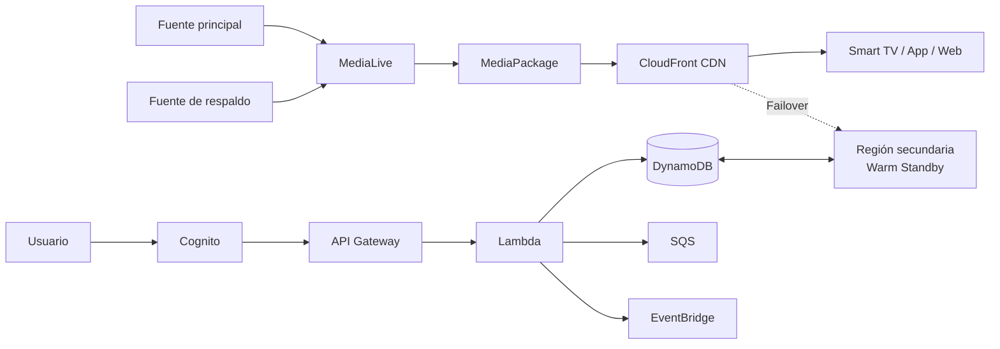

# TAREA 5 – PLATAFORMA DE STREAMING DE VIDEO EN VIVO

**Integrante:** Shanira Ramírez  
**Proveedor Cloud:** Amazon Web Services (AWS)

---

## 1. Contexto y ADR

La plataforma debe transmitir **video en vivo** y soportar picos fuertes de audiencia durante conciertos, partidos o eventos especiales. El reto principal es evitar saturación, caídas, alta latencia y costos elevados cuando la demanda disminuye.

### ADR-001 – AWS con servicios administrados

**Estado:** Aceptado

**Modelo de despliegue:** Nube pública en AWS.  
**Modelo de servicio:** principalmente **PaaS + Serverless + servicios administrados**.

### Decisión

Se utilizarán:

- **AWS Elemental MediaLive:** codificación del video.
- **AWS Elemental MediaPackage:** empaquetado HLS/DASH/CMAF.
- **Amazon CloudFront:** distribución global mediante CDN.
- **Amazon Cognito:** autenticación.
- **API Gateway + AWS Lambda:** backend.
- **Amazon DynamoDB:** datos de usuarios, sesiones y eventos.
- **Amazon SQS:** colas para absorber picos.
- **Amazon EventBridge:** comunicación por eventos.
- **CloudWatch, WAF y Shield:** monitoreo y seguridad.

### Justificación

Los servicios administrados permiten escalar según la demanda sin mantener servidores sobredimensionados. Frente a alternativas como servidores físicos, EC2 administrado manualmente o Kubernetes/EKS, AWS administrado reduce el esfuerzo operativo y mejora elasticidad y disponibilidad.

**Consecuencias positivas:** escalabilidad, alta disponibilidad, menor administración y distribución global.  
**Consecuencias negativas:** dependencia de AWS y posibles costos altos de transferencia durante eventos masivos.

---

## 2. Arquitectura propuesta



### Flujo principal

```text
Cámara / OBS
   ↓
MediaLive
Codifica 1080p, 720p, 480p...
   ↓
MediaPackage
Prepara HLS / DASH / CMAF
   ↓
CloudFront
Distribuye globalmente
   ↓
TV / App móvil / Navegador
```

CloudFront evita que todos los espectadores se conecten directamente al origen y permite distribuir el mismo contenido a una audiencia masiva.

### Flujo del backend

```text
Usuario → Cognito → API Gateway → Lambda
                              ├→ DynamoDB
                              ├→ SQS
                              └→ EventBridge
```

---

## 3. Patrones Cloud aplicados

| Patrón | Servicio | Aplicación |
|---|---|---|
| **CDN / Edge Caching** | CloudFront | Distribuye video cerca del usuario y reduce carga al origen |
| **Queue-Based Load Leveling** | SQS | Absorbe picos de operaciones y evita saturación |
| **Event-Driven Architecture** | EventBridge | Desacopla servicios mediante eventos |
| **Retry** | Lambda / AWS SDK | Reintenta operaciones ante fallos temporales |
| **Failover** | Multi-Region | Mantiene continuidad si falla la región principal |

Los tres primeros cumplen directamente con el requisito mínimo de tres patrones cloud.

---

## 4. Estrategia de escalado

La solución utilizará escalado administrado:

| Componente | Estrategia |
|---|---|
| CloudFront | Distribución global automática |
| MediaLive / MediaPackage | Servicios administrados |
| API Gateway | Escalado administrado |
| Lambda | Escalado por concurrencia |
| DynamoDB | Modo On-Demand |
| SQS | Absorción de picos |

El punto clave es separar el número de transmisiones del número de espectadores:

```text
1 transmisión
   ↓
MediaLive
   ↓
MediaPackage
   ↓
CloudFront
   ↓
Miles o cientos de miles de usuarios
```

Antes de un evento importante se realizarán pruebas de carga, revisión de cuotas, validación de alarmas y prueba de failover.

---

## 5. RTO, RPO y Disaster Recovery

**RTO (Recovery Time Objective):** tiempo máximo permitido para recuperar el servicio.  
**RPO (Recovery Point Objective):** cantidad máxima de datos recientes que se acepta perder.

| Servicio | RTO | RPO |
|---|---:|---:|
| Streaming en vivo | ≤ 2 min | ≤ 30 s |
| APIs y datos críticos | ≤ 5 min | ≤ 1 min |
| Grabaciones / VOD | ≤ 30 min | ≤ 5 min |

### Objetivo general

**RTO crítico: ≤ 5 minutos**  
**RPO crítico: ≤ 1 minuto**

### Plan de DR

Se utilizará **Warm Standby Multi-Region**. La región principal atiende normalmente el servicio y una región secundaria mantiene los componentes críticos preparados.

```text
CloudWatch detecta fallo
        ↓
Se genera alarma
        ↓
Failover a región secundaria
        ↓
Validación de streaming, APIs y datos
        ↓
Recuperación de región principal
        ↓
Failback controlado
```

DynamoDB puede replicar datos entre regiones y CloudFront redirigir el tráfico hacia el origen secundario.

---

## 6. Evaluación Well-Architected Framework

| Pilar | Evaluación | Aplicación |
|---|---|---|
| **Excelencia Operacional** | Alta | CloudWatch, alarmas, automatización y procedimientos |
| **Seguridad** | Alta | Cognito, IAM, WAF, Shield y cifrado |
| **Fiabilidad** | Muy alta | Redundancia, Failover y Multi-Region |
| **Eficiencia del Rendimiento** | Muy alta | CloudFront, Lambda y servicios administrados |
| **Optimización de Costos** | Media-Alta | Pago por uso y escalado bajo demanda |
| **Sostenibilidad** | Alta | Menor infraestructura ociosa |

---

## Conclusión

La propuesta utiliza **AWS Public Cloud con PaaS, Serverless y servicios administrados** para soportar picos de audiencia sin mantener infraestructura sobredimensionada.

El flujo **MediaLive → MediaPackage → CloudFront** permite procesar y distribuir el video de forma escalable, mientras **API Gateway + Lambda + DynamoDB** soportan el backend.

Los patrones **CDN/Edge Caching, Queue-Based Load Leveling y Event-Driven Architecture** mejoran rendimiento, desacoplamiento y resiliencia. Finalmente, la estrategia **Warm Standby Multi-Region** permite trabajar con objetivos de **RTO ≤ 5 minutos y RPO ≤ 1 minuto**, alineando la solución con los pilares del **AWS Well-Architected Framework**.
